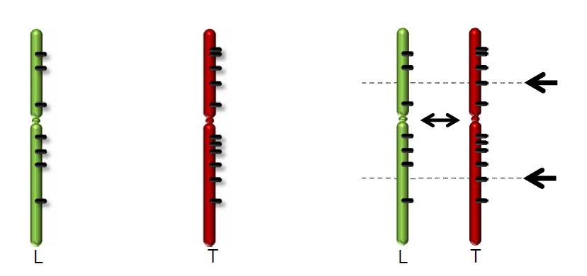
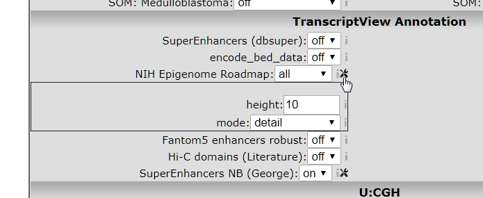
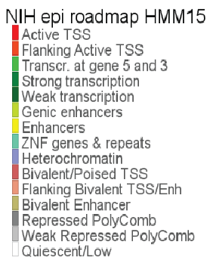
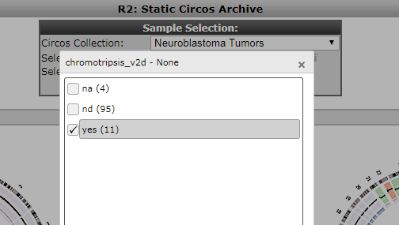

Investigating structural variants
===
*Not every cancer has determining somatic mutations. Using the full power of WGS data, relevant structural variants can be traced also and linked to potential causes of disease*

In this course we will introduce R2, the web based genomics analysis and visualization application. Throughout the course an integrative approach to genomics data will be used. By combining sequencing data with expression data and vice versa, new insights can be derived. Throughout this course we'll focus on data of the childhood tumor neuroblastoma.

We hope to show how R2 can be used to visualize and analyze your WGS data. Please note that this training session requires accounts with additional access. Therefore, make sure that you have obtained a proper account from the tutors. 

This resource is located online at [http://r2-training-courses.readthedocs.io](http://r2-training-courses.readthedocs.io). Additional courses can be found at the same address.  
  
  The grey buttons in this course will bring you to the R2 platform, often with pre-set settings such that you can pick up an analysis easily. The green buttons in this document will open up a Google form, with which you can submit your answers for the respective part of the course.  
  

Introduction 
---
Cancer is a very complex disease. Much more complicated than originally anticipated when the first mutations were found to be causal for specific cancers. At that time, for colorectal cancer, a well defined path of subsequently gained mutations was found to lead to more aggressive tumorigenic cell types (the Vogelstein model).

  
  
  [**Figure 1: Mutation paths during cancer progression.**](_static/images/TumorHeterogeneity_CancerProgression.jpg)

Neuroblastoma is a pediatric tumor of the peripheral adrenergic lineage, which is neural crest derived. During embryogenesis, cells delaminate from the neural crest, migrate ventrally and differentiate into adrenaline- or noradrenaline-producing cells. Neuroblastomas typically express enzymes for the adrenaline-synthesis route. High-stage neuroblastomas usually go into complete remission upon therapy but often relapse as therapy-resistant disease.  

Although there has been extensive research (also in the AMC Oncogenomics group) into mutation mechanisms such as described by the Vogelstein model, such a mechanism has not been found for neuroblastoma. In this practical work session we will explore cutting edge research in the field of this potentially aggressive childhood tumor.
  
Despite decades of research high stage neuroblastoma still has a very poor prognosis. Fortunately, new technologies have become available to molecular biology. These enable us to not only study mutations and RNA expression of genes, but to study the epigenetic modifications of the DNA-associated histones as well. In addition, genes can now be manipulated in cell lines and living tissues.
 

Using advanced data analysis, statistics and clustering methods, the field of bioinformatics tries to derive new insights from these experimental data and help molecular biologists to generate hypotheses that can be tested experimentally. Today you will use the web-based genomics analysis and visualization platform R2. R2 provides you with a set of bioinformatics tools to investigate recent patient and experimental data from neuroblastoma tumors and cell lines. 

 Since cancer is a disease of genomic aberrations we're first going to investigate what aberrations are present and how these might relate to the onset of neuroblastoma. 
 
Exploring the dataset
---
The oncogenomics department of the AMC has gathered a richly annotated set of neuroblastoma tumors. To easily explore this, the R2 development team has devised the concept of Datascopes; a convenient view on the data with some pre-built analyses readily available.  
  
* Go to R2 by clicking on the button below:  
 
<form name="accessing_r2" action="https://hgserver2.amc.nl/cgi-bin/r2/main.cgi" enctype="multipart/form-data" target="R2" method="post">
  <input type="hidden" name="table" value="ps_avgpres_nbadam88_u133p2">
  <button type="submit" class="course r2submit" >Go to R2</button>
</form>  
 

* Log on to the R2 platform with your credentials that were provided (or apply for a login using the link).  
* In the left menu click on **Change Data Scope** > **Training** > **Graduate Training Course**
* For a quick impression of the data select the **Cohort Overview**. R2 shows the available samples in this tumor series with its annotation. In the table at the bottom, each row represents one sample with the respective annotation values. 

The samples of a dataset can be annotated with extra information, for example, clinical data or molecular biology parameters. Each group of annotated data is called a “track” in R2. These tracks can be used to filter datasets, to compare groups of samples, to color scatter plots of samples with meta information, or to correlate genomics patterns with e.g. different phenotypes or demographic characteristics.  

Pie Charts
---

This green button will open up the Google form with which you can submit your answers for the first sections.

 <button class="course googleform" onclick="window.open('https://docs.google.com/forms/d/e/1FAIpQLScLLO8_RAjyTMrLvhEdMqUAxmSwgUDbnHKe1gbFvOXOX8dTeA/viewform?usp=sf_link','_blank');" type="button">Open the form for section 1.3 and 1.4</button> 

The pie charts in the cohort overview allow you to look at the distribution of the annotation values of each available track. If you click on one of the pie slices, this value is used as a filter: both the charts and the table at the bottom now only show the characteristics of the samples with the filtered value. Note that you can scroll down at the right hand side display of piecharts to see more track pie charts. You can also use the dropdown menus to adjust the display.   
 
* Hover your mouse over the different slices of the **stage(inss)** annotation pie chart. Explore with which percentage of samples each staging is present in the current dataset.  
* With the dropdown menu below the main pie chart, select the 'mycn_amp' annotation. 
* Filter the overview of the dataset for samples with a mycn amplification by a click on the 'yes' slice in the pie chart.

--------

   
  **How did the stage(inss) pie chart adapt to the selection of mycn amplified samples and what do you know about these stages in neuroblastoma?** 
 
 

---------

   
Until recently only several genomic aberrations were known:  
   
<table>
<tr><th>  Gene  </th><th>Type        </th><th>Reference</th></tr>
<tr><td>MYCN</td><td>amplification 20%</td><td>(Schwab et al., 1983)</td></tr>
<tr><td>ALK</td><td>7%</td><td>(George/Mosse/Janoueix-Lerosey/Chen 2008)</td></tr>
<tr><td>CyclinD1</td><td>amplification 4%</td><td>(Molenaar et al., 2003)</td></tr>
<tr><td>PHOX2B</td><td>4%</td><td>(van Limpt et al., 2004)</td></tr>
<tr><td>PTPRD</td><td>4%</td><td>(Stallings et al. 2006)</td></tr>
<tr><td>NF1</td><td>3%</td><td>(Hölzel et al., 2010)</td></tr>
<tr><td>PTPN11</td><td>2%</td><td>(Merks et al., 2004, Bentires-Alj et al., 2004)</td></tr>
<tr><td>FOXR1</td><td>1%</td><td>(Santo et al., 2011)</td></tr>
<tr><td>LIN28B</td><td>1%</td><td>(Molenaar et al., 2012)</td></tr>
</table>
 
To gain further insight, the Oncogenomics department of the AMC set out to sequence 87 untreated primary neuroblastoma tumours of all stages from this set.  
  

Somatic mutations in neuroblastoma
---
The samples were sent to the Complete Genomics sequencing facility, now taken over by BGI, for whole-genome paired-end sequencing. They provide a sequence as a service model. Genomes were sequenced at an average coverage of 50. Compared to the HG18 reference genome, an average of 3,347,592 singlenucleotide variants (SNVs) per genome were obtained, which is in accordance with reported frequencies of interpersonal variants. 

The R2 development team has processed these WGS data further using the CGAtools software to compare tumor with lymphocyte genomes. This provided a somatic score, estimating the likelihood of mutations to be somatic. Through several filtering steps the somatic mutations were determined with respect to the reference genome.

  
	
  [**Figure 2: Comparing Tumor data with a reference genome from Lymphocytes.**](_static/images/structural_variants_reference_genome.png)

A comprehensive list of the mutations can be accessed through R2. 

  * Go back to the Graduate Training Course datascope (still open in another tab).
  * Select the **somatic variants** tile.
  * A table with all mutations in the 86 tumors appears in a new tab. It is basically a view on a database table. Ordering on its columns is possible by clicking on the column header. Sort the column by gene name. 

---------
  **Can you spot recurring mutations?**

 
 

---------

  
* Notice that no mutations recur more than a few times. 
* Go to the *ALK* gene. 

---------
  **What type of aberrations does the ALK gene suffer?**
 

---------

* Select the **view** link (note: this is separate from the detail link). 

In a new tab this mutation is shown in the R2 GenomeBrowser zoomed in on the genome to the base level. All samples are drawn beneath this stretch showing the specific mutations that were found. Annotation of the publicly available COSMIC database, the Catalogue Of Somatic Mutations In Cancer, is shown in the GenomeBrowser as well. COSMIC is the world's largest and most comprehensive resource for exploring the impact of somatic mutations in human cancer.

The buttons on top of the page can be used to zoom in and out and to move your position. This way you can "walk" over the genome, for instance to have a closer look at the transcription start site of a gene.  
* Try out a few of the buttons.  

The GenomeBrowser has a tremendous number of parameters that can be set. 
* Scroll down to the lower half of the page.  

A form shows quite some parameter fields. These provide additional optional annotations and settings for the GenomeBrowser. A useful annotation is provided by the NIH epigenome roadmap that annotates the genome with chromatin modification data, which is based on methylation and acetylation patterns of the genome. This annotation, however, is only provided on another Human Genome build. 
* In the **Adjustable settings** form change the **GenomeBuild** to **HG19** (note that other builds as well as mouse data is available also). Click **redraw**
* Several annotations that were available for HG18 are not available for HG19. Find the **Refseq(R2)** and switch the setting on to obtain gene annotation for this genome build. Click **redraw**. 

---------
  **ALK is no longer in frame at the same position on the genome. Can you think of a reason why this is the case?**

 
 

---------

* If the ALK gene is out of scope, you can jump back to the gene with the help of the text field in the left upper corner **Find gene**: type in the gene name *ALK*. 

The button below ('Cleaned up View in R2') brings you to the transcription start site of the ALK gene. Several genome annotations will be switched on or off in that view. If you want, you can try them out yourself first:
* Switch *off* the following annotation settings by scrolling all the way down to the Tracks settings box. Settings that are on are highlighted in green:
    * **cosmic** (in the Genome Variation box) to switch off the annotation from COSMIC, 
    * **Calldif Somatic Genome** (in the X:Complete Genomics => Variants box) to switch off the Somatic mutations annotation. 
    * **TestVar AMC v2e (Exome&1kup)** (also in the X:Complete Genomics => Variants box) to switch off the Cohort summary.
   Don't forget to click **redraw** whenever you want your changes to take effect.
* Set the **NIH Epigenome Roadmap** annotation to *all* (in the TranscriptView annotation box). This annotation provides information on public datasets that have established whether chromatin regions are subject to active transcription (green), enhancer regions (yellow) or are part of a transcription start site (red). Click **redraw**.  

In order to be at the correct position, simply click the button below:

<form name="accessing_r2" action="https://hgserver2.amc.nl/cgi-bin/r2/main.cgi" enctype="multipart/form-data" target="R2" method="post">
  <input type='hidden' name='option' value='gbv2_base'>
  <input type='hidden' name='modus' value='geneview'>
  <input type='hidden' name='genome_build' value='hg19'>
  <input type='hidden' name='chrom' value='chr2'>
  <input type='hidden' name='start' value='29963600'>
  <input type='hidden' name='end' value='30163600'>
  <input type='hidden' name='a10refseq' value='on'>
  <input type='hidden' name='epi_roadmap' value='all'>
  <button type="submit" class="course r2submit" >Cleaned up View in R2</button>
</form>  

* Zoom in more on the transcription start site of the gene by selecting a region; see image (hint the color of the transcript denotes the reading direction; green means 5'-to-3' (sense), red reads from 3'-to-5' (antisense)) 
* Click **redraw** (Note: the NIH annotation only appears for regions under 200.000 bp)

  
	
  [**Figure 3: Selecting a region.**](_static/images/structural_variants_selecting_region.png)

This NIH Epigenome Roadmap annotation is actually a sum of data from a lot of data sources. These sources can be further detailed by selecting the detail view in the toolbox that appears when you click the tools icon, see image below.
 * Select **mode:** *detail*, and click **redraw**. 

  
	
  [**Figure 4: Opening the NIH parameter settings toolbox.**](_static/images/structural_variants_selecting_toolbox.png)
  
  
   
	
  [**Figure 5: Annotation colors with the chromatin state description.**](_static/images/NIHepiRoadmap.png)
  
  
  

---------
  **What do the red colored chromatin annotations mean and what does that show you about the ALK TSS?**

 
 

---------

* Submit your form with answers of sections 1.3 and 1.4

Further use of WGS data; structural variants
--------------------------------------------
WGS data allows for further analysis; the paired end technique enables the discovery of structural variants.

  
	
  [**Figure 6: Paired end sequencing makes discovery of structural variants possible.**](_static/images/structural_variants_paired_end.png)

These structural variations are best visualized as so called _circosplots_. 
* To access these circosplots in R2, go to the Graduate Training Course datascope and click the **circos archive** tile.  

An overview of all sequences appears displayed as circos plots. These give an immediate comprehensive view on the state of the genome. 
* Click on one of the circos plots in which you can see many structural variants (many crossing arcs in the circle).  

In a new tab a detailed view of this specific tumor genome is shown. When hovering over the plot the mouse opens a magnifier window.

This green button will open up the Google form with which you can submit your answers for sections 1.5 and 1.6.

 <button class="course googleform" onclick="window.open('https://docs.google.com/forms/d/e/1FAIpQLScJf_kpFbMQx6Y6xW8Yb4SdMGlXir3Tbpsip-oUZKwzNVAQ1g/viewform?usp=sf_link','_blank');" type="button">Open the form for section 1.5 and 1.6</button> 

---------
  **What do the green and red areas mean in the circosplots? And the arches crossing the circle?**

 

---------

In the tabbed panel to the right of the circos plot all information is detailed. 
* Open the _sample annotation_ tab if it is still closed.
    *  Scan the patient characteristics
* Now open the _Somatic Structural Variants_ panel   

---------
  **Can you locate a structural variant that involves a gene and spans two chromosomes? (Note: clicking on the _view_ link shows the actual locations on the genome)**

 

---------

Chromothripsis
---
While investigating the WGS data, an interesting phenomenon was observed. In some tumor samples parts of the genome appeared to be riddled with structural variants, resulting in a shredded chromosomal structure.

[**Figure 7: Example of a shredded chromosomal structure**](_static/images/structural_variants_shredded_chromosomal_structure.png)

* Go to the overview page with circos plots.

---------
  **Can you spot an example of such shredding from the circos overview? (Hint: remember how an SV is depicted in a Circos plot)**

 

---------

The shredding pattern is known by the term *chromothripsis* (‘shattered chromosome’). The complex recombination pattern of alternating discrete copy numbers that is associated with the phenomenon is hypothesized to occur from a single catastrophic event. In this process, copies of oncogenes can become amplified and tumor suppressor genes can be lost.  

Patients containing such a phenomenon have also been annotated in the neuroblastoma cohort. Within the Circos archive we can also use filters to focus on intersections of the cohort. In the top of the screen select 'chromothripsis' from the 'select a track' dropdown and subsequently click on 'yes' and then 'ok' to apply a filter. Then press redraw to depict only cases with marks of chromothripsis.

[**Figure 8: Selection of a cohort intersection via a track.**](_static/images/select_track_cg_circos.png)

---------
  **Can you spot a chromosomal pattern in the chromothripsis cases?**

 

---------

To see how chromothripsis relates to clinical data we can investigate survival data in R2. 

* From the left menu in the main Graduate Training Course datascope panel select **Kaplan Meier > By track (category)**
* Make sure that the correct **Data Type** *'Expression data(H. sapiens)'* and that the correct neuroblastoma dataset has been selected in the dataselection panel: *'Tumor Neuroblastoma (combat) - Versteeg - 122 - MAS5.0(bc) - u133p2'*. Click **Next**.
* A selection menu appears, in the **Separate by** field select *track* and in **use track** select the track cg_chromothripsis. Then click **Next** 

---------
  **How does chromothripsis affect survival?**

 

---------

* Filtering for subsets allows you to further isolate specific survival characteristics. If you like you can toy around with different parameters.
* Submit the Google form with your answers for section 1.5 and 1.6

Locations of structural variants, hotspots?
---

This green button will open up the Google form with which you can submit your answers for section 1.7.

 <button class="course googleform" onclick="window.open('https://docs.google.com/forms/d/e/1FAIpQLSec1Us3rWYcdAh3ZDNirrnTbaJtjdvEmLNlIkE1nAyXF7z87w/viewform?usp=sf_link','_blank');" type="button">Open the form for section 1.7</button> 

Chromothripsis can be seen as an extreme case of concentration of structural variants in one sample. The question arises whether there are other hotspots of structural variation on the genome that are found in multiple samples. These might point to functional interactions.

* One of the genes that exhibited such a hotspot is the TERT gene. Go back to the startpage of the Graduate Training Course portal and select the GenomeBrowser tile. This brings you to the TERT gene on the genome with some preset annotations. 

---------
  **How does this region qualify as a hotspot?**

 
 

---------
 
 As is obvious from the high number of peaks around the TERT gene there is a hotspot of structural variants in that area. The types of variants are annotated below the stretch on the genome.   

---------
  **What do the arrows and colored tracks mean? (Hint: hovering with the mouse provides additional information)**

 
 

---------

Red arrows depict translocations to other locations in the genome. 
* Locate the translocation to chromosome 11 for sample N724TL (Hint: hovering over the arrows gives sample information. Alternatively, you can select the sample annotation of *N724TL* in the dropdown of **Junction_diff** in the setting block **Genomics => Structural Variation**. Don't forget to **redraw** if you choose to display this sample annotation only.) 
* **Click on the red arrow**.  
R2 brings you to the other side of the translocation. By switching on available annotation about superenhancer locations, we can learn more about this translocation. 
* In the TranscriptView panel switch on the SuperEnhancers NB annotation and click **redraw**.
 
In our department H3K27ac ChIP-seq data was produced for several neuroblastoma samples. 
* Click on the button **Load/Store Profile** in the top right corner, click **Execute** and click **Goto the GenomeBrowser** to view the ChIP-seq data generated by our department on chromosome 11 at the translocation site of the TERT gene.
* Now go back to TERT by typing the gene name into the textfield at **Find gene** in the top left corner. You can zoom out a bit to have a better overview of methylation profiles at the TERT gene location. 

 ---------
  **How is the H3K27ac ChIP-seq data related to the information about superenhancers?**
 
  **What advantage would a tumor have from this translocation?**
  
 
 ---------   

this junction in more detail and produced methylation data 
To further corroborate this we can go to the Circos plots panel again. 
* Go back to the **Graduate Training Course datascope** overview panel and click the **circos archive** tile again.
* Locate the N724TL tumor sample and **click on the image**.
* Open the **Gene Expression list** tab
* This can be further explored by **clicking on the probeset link** (left column in the list) and on the Detailed link.

---------
  **How is the expression of the TERT gene affected?**

 
 

---------
 * Submit your Google form with the answers for 1.7
 
Remarks
---
This ends the first part of this course. You can continue now with the analysis of intra-tumor heterogeneity.
We hope that this course has been helpful. At the end of the workshop, please provide feedback on the course with <a href="https://docs.google.com/forms/d/e/1FAIpQLScy5xoA4btrYfuOOhc5qFKmYkV9_SBv1PQABPgV7eVJY8gk4A/viewform" target="_blank">this form</a>.  

If you want to have your genomics data visualized and analyzed using the R2 platform you can always consult r2-support@amc.nl

The R2 support team.

