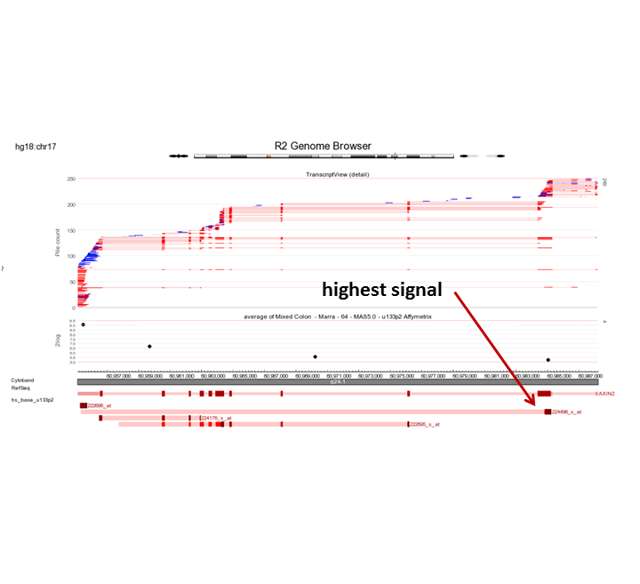
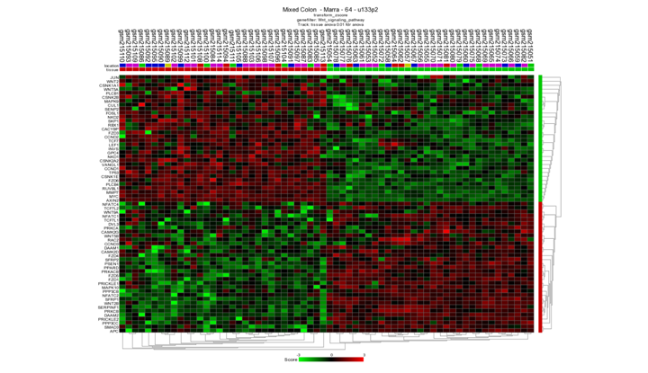
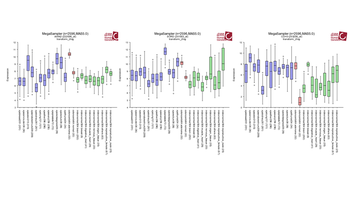
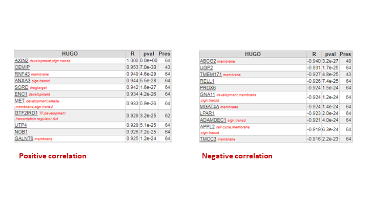
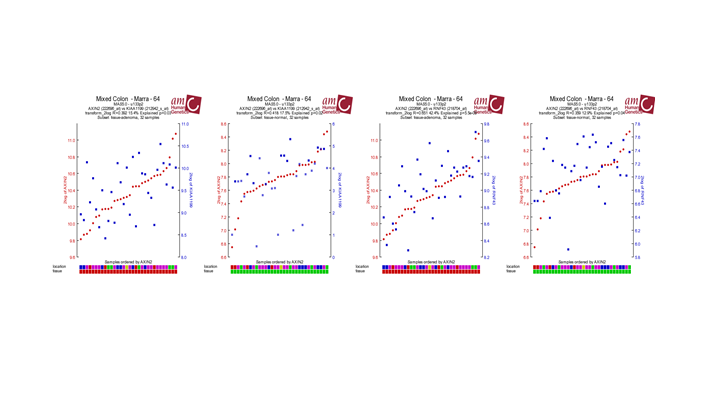
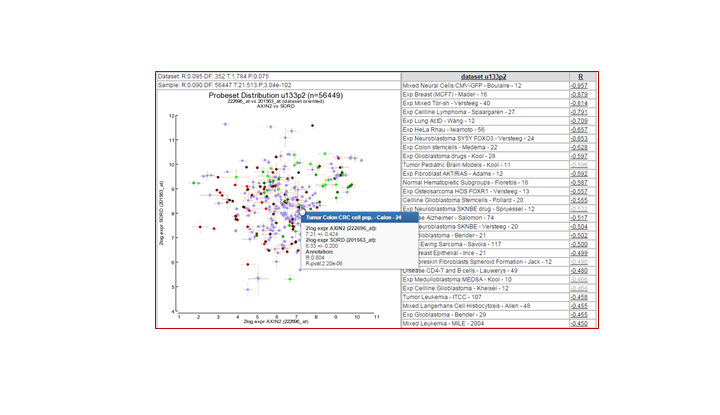
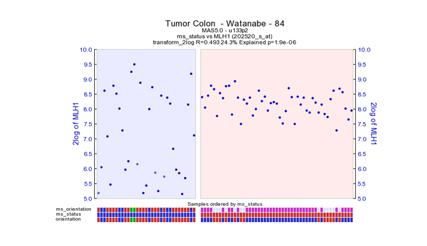
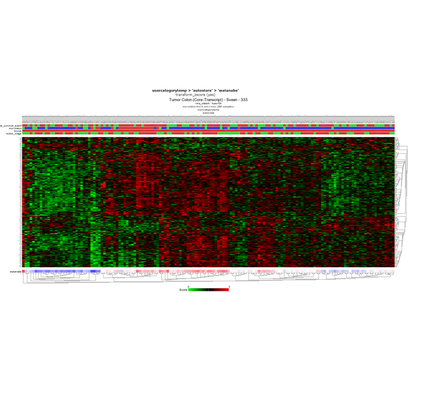
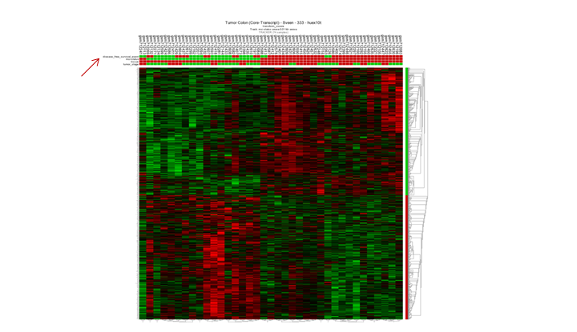
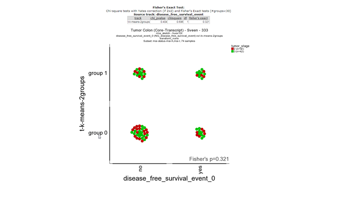

Differential gene expression in micro-array colon cancer data
=================================

*Some typical analysis that can be performed using micro-array data, in this case from Colon cancer dataset*

The purpose of this practical session is to get a grip on microarray data analysis.
We will try to answer some questions using two colorectal cancer datasets by applying
the web based analysis platform R2 (http://r2.amc.nl ir http://r2platform.com) which has been developed within
the Department of Oncogenomics at the Academic Medical Center (AMC) in Amsterdam,
the Netherlands. The principles and features you will encounter during this workshop
are well established in the community that analyze and visualize microarray data.
An online step by step tutorial book is available in the help section of R2.
We will often refer to these tutorials.

This resource is located online at http://r2-training-courses.readthedocs.io

Introduction
------------

First Part: Colon versus Normal tissue
------------

In the first part we start by analyzing a dataset that has been used to identify the differences between normal tissue and colon adenomas. This dataset can be found in R2 as "Mixed Colon - Marra - 64 - MAS5.0 - u133p2".
For more information on the background of this dataset click on the infobox icon ‘i’ next to the current selected dataset.
The name of a dataset is composed of a number of elements, separated with a ‘-’. The Marra set consists of 64 samples and is of a mixed type (32 normal and 32 adenomas).
The normalization was performed according to the MAS5.0 algorithm and we are dealing with an Affymetrix U133 plus 2.0 microarray consisting of ~54,000 so called probe-sets (reporters).

We will use R2 to generate a list of genes which are differentially expressed between the Normal subgroup and Adenoma subgroup in the Marra dataset. Chapter 6 of the R2 tutorial book (Differential expression of Genes) describes how you can use the *Find differential expression between groups* module in more detail. 
Multiple testing corrections adjust p-values derived from multiple statistical tests to correct for false positives. In microarray data analysis, false positives are genes that are found to be statistically different between conditions, but are not in reality. (For more on multiple testing correction: see chapter 6 step 7 in the tutorial book)

##### Questions: Part I

Select the **Mixed Colon - Marra - 64 - MAS5.0 - u133p2** or click the button 

<form name="Mara 64 set " action="https://hgserver1.amc.nl/cgi-bin/r2/main.cgi" enctype="multipart/form-data" target="R2" method="post">
  <input type="hidden" name="table" value="ps_avgpres_coloncombi64_u133p2">
  <button type="submit" >Go to Mixed Colon Marra</button>
</form>  
 

In the Main menu, **select type of analysis** in box 3 by clicking on the *Find differential expression between groups* module in the dropdown. And click **next**. Or click the button below.

<form name='Find Diff' action="https://hgserver1.amc.nl/cgi-bin/r2/main.cgi" enctype="multipart/form-data" method='POST' target='FindDiff'>
<input type='hidden' name='option' value='findgene1'>
<input type='hidden' name='table' value='ps_avgpres_coloncombi64_u133p2'>
<button type="submit" >Go to Find differential </button>
</form>
 
In the next panel you have to **select a track**.
So called tracks contain the annotation parameters of series of arrays of tumors or experiments. Choose the *tissue* track, as this contains assignment of each sample to the tumor or normal tissue group. Several other selection criteria can be adapted. Most settings are suited for regular analyses.

**Question 1a:**

You can also choose between several multiple testing correction methods. Which one is the most stringent?
*Answer: At the end of this training course*

Before we start the calculations, make sure you selected *log2* as transformation and use *p<0.01* as a p-value cutoff. Then click **next**, and leave the group selection as is, click **next** again to start the analysis.

**Question 1b:**

R2 has generated a large list of genes which are differentially expressed between the selected subgroups. Can you say something about the distribution between up- or down-regulated genes?  Are the groups equal in size? (Hint: On the right side you can find buttons for further analyses, but also tables with summaries of the data).
*Answer: At the end of this training course*

**Question 1c:**

Next to many publicly available datasets, R2 also hosts a lot of curated lists of genes which we call gene sets. These gene sets can be used to restrict an analysis as well. We can adapt our current search by scrolling down to the end of our gene list. There we find the Adjustable settings menu with which several settings can be chosen to adapt the analysis.   
We are going to limit our analysis to genes specifically known to be involved in colorectal cancer. In the **Gene Filters** box you can use a **Gene set** to filter your list. Use the last dropdown of this Gene Filters box to first select the category with gene annotation from KEGG, *C: geneannot_kegg*. Click again on the **same dropdown menu** to now see an expended list of subcategories, and choose *SC: Human Diseases*. Again use the **same dropdpwn field** to find that the list of options has been expanded to show gene sets (GS). Select the one that you think is appropriate for our analysis. Click on **Adjust Cutoff** at the bottom of the Adjustable settings menu to 
*Answer: At the end of this training course*

**Question 2a:**

The most significant gene in the list is the AXIN2 gene. Click on this entry from your result set to open the Gene View. The graph shows a neat separation in groups. Scroll down to investigate the probesets that were used. AXIN2 is represented by no fewer than four reporters (probe sets) on the Affymetrix U133 Plus 2.0 chip. 

Examine the expression signals of the 4 probe sets, what do you notice
*Answer: At the end of this training course*

**Question 2b:**

Can you think of an explanation for this observation? (Tip: Use the R2 genome browser by clicking the 'R2 Tview' link in the probeset verification table.

**Question 2c:**

Do you think it is wise to represent AXIN2 by the average of the four probe sets. Why / why not? (Tip: Use the R2 genome browser by clicking the 'R2 Tview' link in the probeset verification table. 

**Question 3a: Pathway heatmap**

The WNT pathway is an important signal transduction cascade in the development of colon cancer.
Generate a list of genes which are differentially expressed comparing normal and adenoma within the WNT pathway KEGG, use the False Discovery Rate for multiple testing correction, log 2 values and P <0.01. You can use the KEGG Pathway from the Gene Categories selection menu.

**Question 3b:**

Generate a heatmap (Menu to the right) from the differentially expressed genes and take a look at the resulting image. Are all tumors neatly separated from the normal samples? Is this a special finding?

**Question 4a: Pathway Analysis**

Often, you do not immediately have an idea which pathways you could look for in your comparisons between groups (normal versus adenoma in our case). A module within R2 providing you with some suggestions is the so called KEGG Pathway Finder by Groups. It assesses whether the number of genes that show significant differential expression between normal and adenoma is significantly higher than you would expect compared to all genes that are mentioned in KEGG. 

Perform a KEGG pathway analysis from the ‘main’ page. Make sure that under Representation: all is selected (both under and overrepresentation) Are there KEGG pathways overrepresented in the differentially expressed genes between adenoma and normal tissue?

If this is true which pathway (Set the p-value 0.01 for the analysis and select striking pathways).

**Question 4b**

In the current pathway analysis, the WNT pathway is not very pronounced. Click on the WNT pathway AMCmap (the blue A link) of the pathway in detail. 
It appears that there are not many changes found? Can you explain the results of the analysis?

**Question 5a Pathway heatmap specified**

The previous task has shown that a number of WNT pathway genes were represented in the result list. We can also view all genes in the pathway via a heatmap. You can do this using the "View a geneset (Heatmap)" option from the main menu. 

Take a look at the WNT pathway with 3: "View GeneSet (Heatmap)". You can find the WNT path way in in the KEGG>all section. Are all tumors neatly separated from the normals? Is this special? Why / why not? 

**Question 5b:**

In what way does this result differ from task 3b?

Classical pathway analyses, with sets of genes as members of a pathway, have been used extensively and yielded some valuable insights when applied on mRNA data. However, they are not necessarily informative, since many pathways have been characterized at the protein (modification) level. As such, activation of a pathway does not need to have an effect on the mRNA levels of the members of the pathway themselves. This realization has led to the development of ‘functional pathway signatures’, where pathway activity is induced/repressed in an experimental setup, and the impact thereof measured on all mRNAs. mRNA levels that are differentially expressed between active vs inactive pathway status, can then be used as an mRNA proxy for pathway activity. Published functional pathway signatures are collected by the MSigDB of the Broad Institute in a special section of their gene set database (oncogenic_signatures). Within R2, we can also use these sets via the “View a geneset (Heatmap)� option.

**Question 5c:**

Return to the main page and select “View a geneset (Heatmap)� again. Press ‘next’. Now from the gene selection dropdown list, select ‘geneset_broad_2012_oncogenic’ and press ‘next’. Again press next. Now, from the gene set(s), area select a complete beta catenin (BCAT) signature (Hold CTRL key to select a UP and a DN gene set combination). Press ‘next’ again to create a heatmap representation. Are the 2 groups also separated on the basis of the BCAT signature?

**Question 6a: Clinical relevance**

Genes that show a big difference in their expression between normal and adenoma tissue can be of clinical relevance. To see whether this is the case we can investigate their expression in multiple datasets

Try to find out whether the three most differentially expressed genes identified in Question 1b (AXIN2, SORD and CDH3) show a similar expression pattern in other tumors. Do this by using Mega Sampler. (Chapter 10 of the tutorial book). In the main menu select in section I , Across datasets Use the preset: Practicum001.

**Question 6b:**

Are there drug targets listed in the list of differentially expressed genes? If so, in which of the 2 possible groups are they listed?

**Question 7a:Investigate specific genes**

In the previous exercises we have focused on the differences between two groups within the colon dataset. Another starting point of your analyses could be a gene of interest. We already encountered AXIN2 in our analysis.

Try to analyze which genes show a correlated expression pattern with AXIN2 in our dataset. Which genes are in the top3? (See chapter 7 of the tutorial, “Find genes correlating with your genes of interest�)

**Question 7b:**

In the differential expression analysis between normal and adenoma samples, we also found AXIN2 to be differentially expressed. Therefore it is possible that the correlation analysis is biased (in other words, the correlation is solely caused by the 2 groups of samples).

To investigate whether there is a bias, we can inspect the correlations for the top 3 genes of the correlation analysis in 2GeneView by clicking on the gene name. Tip: You can use 2GeneView to select for a subset of samples (so you can assess the significance of correlation in only the adenoma’s or only the normal samples).

**Question 7c:**

You can strengthen the argument of a correlation between 2 genes if such a relation can be identified in other cohorts as well. In R2, we can easily check this relation in all datasets that are available by using the ‘2D-distribution’ from the 2GeneView page.

Examine the 2D distribution of the gene which is most promising. Is this correlation only found in our dataset or does this correlation also apply to other datasets?

##### Answers: Part I

Question 1a:

*With high throughput experiments like micro-arrays it is important to correct for the random effects that could be falsely significant. Therefore, it is common practice to correct for those effects. The Bonferroni Method is the most stringed method R2 is offering. A more detailed explanation can be found in the the R2 tutorial. You can find the R2 tutorial in the right upper corner of R2 on the main screen.*

Question 1b:
*A small table below the grey buttons on the right provides the separate numbers of the up and down regulated genes. ~8000 genes in total. ~4000 genes are higher in adenomas and 3903 lower than in normal tissue.*

Question 1c:

*When using the Oncogenesis gene set or KEGG colorectal cancer, AXIN2 is number one. The table below is the toplist of the analysis in 1b*

	
[**Finding differential expression progression.**](_static/images/practical_geneexpression_list.png)

Question 2a:

*In the perfect world, each probeset should provide a more or less equal absolute value which is not the case.  The 222696_at signal is much higher compared to the other AXIN2 probesets.*

	
[**Finding differential expression: probeset table**](_static/images/practical_geneexpression_probesettable.png)

Question 2b:

[**Finding differential expression: probeset verification**](_static/images/practical_geneexpression_probesetverification.png)

Question 2c:

*Due to the large difference in the signals, it will not be smart to take the average in this case. The successors of this platform are designed differently as well as the isolation methods. For the newer platforms there is no degradation and the probesets designed for the same gene give more or less the same signal.*

Question 3a:

64 genes
tissue: normal < adenoma 31
tissue: normal >= adenoma 33 

Question 3b:

*Neatly separated, but not very special. Only the genes that make a difference between the two groups viewed here. The Heatmap is based on a pre-selection which is already found*

[**Finding differential expression: heatmap**](_static/practical_geneexpression_heatmap1.png )

Question 4a:

*DNA replication and RNA transport are in the top off the list* 

Question 4b:

[**Finding differential expression: Pathway**](_static/practical_geneexpression_pathway.png )

Question 5a:

*Samples are well separated. This is special, we have all the genes in the wnt pathway used without preselection.*

[**Finding differential expression: heatmap**](_static/practical_geneexpression_heatmap2.png)

*
This time not only the genes are used that make a difference in the group shown.  The clustering in task3b was based on differentially expressed genes already found so it’s not surprising you find a heatmap with nice clusters.*

Question 5c:

[**Finding differential expression: heatmap**](_static/practical_geneexpression_heatmap3.png)

*Yes, the groups are clearly also separated based on the BCAT signature.*

Question 6a Clinical relevance

[**Finding differential expression: megasampler**](_static/practical_geneexpression_megasampler.png)

Question 6b 

*In case there are drug targets listed in the the list generated with the differentially expressed genes these are indicated in the description after the gene names in red. The up regulated genes are possible candidates for drugs. You can also use a genecategory of drugtargets in the Adjustable Settings panel as filter to select drugtargets exclusively.
Find diff expression (genecategory drugtargets) > 608 genes*

*tissue: normal < adenoma 283* 
*tissue: normal >= adenoma 325*

Question 7a

[**Finding differential expression: List**](_static/practical_geneexpression_singlegenecorrelation.png)

Question 7b

[**Finding differential expression: 2 gene view**](_static/practical_geneexpression_2geneview.png)

*Investigate the correlation for two genes for each subgroup with the two gene view if there is still a significant correlation you can conclude that there is no bias.*

Question 7c

*2d shows the distribution of multiple colonic rnf43 sets a significant correlation, the Kia shows this to  a lesser extend*

*Tumor Colon MS - Jorissen - 155 0.734*

*Ref Common Reference - na - 50 0.758*

*Tumor Colon - Watanabe - 84 0.764*

*Tumor Colon - Sieber - 290 0.779*

*Tumor Colon - Smith - 232 0.797*

*Mixed Colon - Skrzypczak - 145 0.820*

*Mixed Colon - Uddin - 59 0.831*

*Mixed Colon - Matsuyama - 111 0.842*

*Tumor Colon - EXPO - 315 0.842*

*Tumor Colon Rectum - EXPO - 38 0.878*

*Mixed Colon - Balazs - 53 0.928*

*Mixed Colon - Marra - 64 0.949*

[**Finding differential expression: 2 gene view**](_static/practical_geneexpression_2dview.png)

Second Part: MSI in Colon tumors.
----------------------------

The next section we will use another dataset. Select **"Colon Tumor - Watanabe - 84 - MAS5.0 - u133p2"** 
This data set consists entirely of colon tumors (84 samples), 33 tumors are characterized by microsatellite instability (MSI). The remaining 51 tumors were microsatellite stable (MSS) and are characterized by chromosomal instability. 
In MSI colon cancer, genes of the DNA mismatch repair system play an important role. Germline mutations in these genes are a major cause of the inherited form of colon cancer, namely HNPCC (hereditary nonpolyposis colon cancer). 
In sporadic forms of colon cancer however, these genes are frequently inactivated. Inactivation is often achieved via hypermethylation, switching the gene off. Hypermethylation of genes in colon cancer is most common in colon tumors with a proximal location in the colon and much less in colon tumors with a distal location. 
Sporadic MSI colon tumors usually have a proximal location. MSI tumors are also found distally, however it is not clear which genes are exactly involved 
In this data set of 84 tumors, we will also look at differences in expression between proximal and distal colon tumors. We can analyze the complete set or look at sub selection (only MSI, MSS, etc).

##### Questions: Part II

**Question 8a: Overrepresentation on chromosome regions**

This dataset consists of Microsatellite stable (MSS) tumors and microsatellite instable (MSI) tumors.

Use the “Find Differential expressed genes between groups� module to generate a list of genes that is differentially expressed between MSI and MSS characterized tumors.

**Question 8b:**

Can you identify chromosomes where genes of this set are overrepresented? If so, is there a possible explanation? To see whether differentially expressed genes are more frequently expressed than expected on certain chromosomes, click on the 'Chromosome map', which can be found on the right hand side of the page with all the differentially expressed genes.

**Question 8c:**

If you want to examine genes differentially expressed on a particular chromosome more closely, we can re-analyze the dataset with gene category as a filter. Instead of all differentially expressed genes, now select the desired chromosome. Do this once (for example for chromosome 18).

**Question 8d:**

Are genes equally distributed for the up regulated and down regulated genes? Can you think of an explanation for this result?

**Question 9a: Finding genetic causes**

Because we know that DNA repair genes play an important role in microsatellite (in) stability, we can use a set of DNA repair genes to examine whether these genes are differentially expressed between MSI and MSS tumors. Go back to the previous settings for "Finding differentially expressed genes" and then select from 'GeneCategory' the ‘DNA repair’ genes. There are 247 genes annotated as DNA repair genes. 

How many of the DNA repair genes have a higher expression in MSI tumors, and how many have a higher expression in MSS tumors?

**Question 9b:**

One of the genes differentially expressed in the generated is MLH1 which is also lised in the article of Watanabe et al. Look at the expression pattern of MLH1 in colon tumors, both sets (MSI vs. MSS). 

What do you notice? 

**Question 9c:**

Could it be that the expression of MLH1 is different in certain subsets of the MSI and / or MSS tumors compared to other tumors? Which subset (s) is / are they? 

**Question 9d:**

Do you have a possible explanation for these differences? 

**Question 9e:**

Which gene correlates strongly with the expression of MLH1?

**Question 9f:**

Click on the best correlating gene to generate a correlation plot. What is known about this gene? This can be investigated by using the Pubsniffer tool, a convenient tool for structured Pubmed searches. Click on the gene names in the left panel to use it.

**Question 9g:**

On which chromosomes are MLH1 and this gene located? Use the R2 Tview link and zoom out if necessary.

**Question 9h:**

Do you note anything remarkable?

**Question 9i:**

 Can you explain why the expression of these two genes are so closely correlated?
 
 **Question 9j:**
 
 Amongst the genes that correlate with the expression of MLH1, there is a striking amount of genes originating from a single chromosome.
 
 Which chromosome is it?
 
**Question 9k:**
  
 Do you have a possible explanation for this event?
 
 
**Question 9l:**
 
 Search for genes that correlate with the MLH1 expression, but only in the MSI tumors. In the selection Criteria panel use the sample filter to select for the right subgroup. Do click the red  **confirm **link!  Can you find other genes which are correlated with MLH1? Such as? 

**Question 9m:**

By which Gene Ontology process are these genes are primarily characterized? (Select from the menu to the right)

**Tips for to do:**

In Question 8a you generated a list of differential expressed genes. It is interesting to check or validate your genelist with other datasets present in R2. The set used in this section also has survival annotation.

**Question 10a Relating tracks**

*Note: To store genecategories and/or tracks you have to be logged in).  For this part creating a user account and/or login if you haven't done so is neccessary*

Generate a list of differentially expressed genes between MSI-MSS annotated tumors. Select again the ‘Tumor Colon - Watanabe - 84 - MAS5.0 - u133p2’ dataset. Select “Find Differential expression between groups. Adapt the following settings in the “selection criteria� panel, set test p-value to 0.001 and Correct for Multiple testing to Bonferroni.

In the right panel you can store your result as a genecategory. Give the list a meaningful name and store you result in the personal track section (Note: The 24 hrs option deletes your stored results automatically after 24 hrs).

**Question 10b**

We’re now going to use this gene category as a set to explore other datasets. 
Select ‘Tumor Colon (Core-Transcript) - Sveen - 333 - rma_sketch - huex10t’ in the main menu (take care: don’t select the Tumor Colon (Core-Exon) - Sveen - 333 - rma_sketch - huex10p version).

At the main page select at 3: ‘Type of analysis’-> ‘View a geneset (Heatmap)’ and click next. In the ‘adjustable settings’ panel you can select a subset of the patients with the ‘sample filter’. Select the msi-status from the droplist, and subsequently select mss, msi-h and msi-l. Do not forget to click the red **confirm ** link. In the Genecategory section select the genecategory you just generated in the personal track section. This can be done by first selecting ‘My GeneCategories’, and click next, click next and select the category just created.

The heatmap clearly shows a pattern, suggesting a different gene expression pattern between the MSI and MSS group. Does the disease free survival track correspond with the gene expression pattern?

**Question 10c**

 
Use the “Find differential Expressed genes between Groups� module to generate a list of differentially expressed genes between the msi-l and msi-h subgroups.  Select the Bonferroni method for the multiple testing correction and store the genelist as a gene category again giving it a meaningful name. 

In your browser, go back to the tab with the list of genes and click on Heatmap (z-score) button. Do you think that there is a relation between the disease free survival event track and the MSI status?

**Question 10d**

The second generated heatmap suggests that there is a relation. However this is not statistically proven. Combining two R2 modules allows you to calculate the significance of the relation between subgroups in your dataset.

We can use our list of differentially expressed genes as a signature in R2, and separate the patient cohort on the basis of this gene-category. For this, we can make use of the k-means function in the platform. (For more on the K-means clustering algorithm see chapter 11 in the tutorials book on that subject)

In the Main menu, select ‘Type of analysis’ -> ‘K-means’, and click next, in the Adjustable settings panel select the msi diagnosed tumors only at sample filter , click confirm !! , select at Gene category section the geneset you generated and stored at task 10a (Wanatabe msi-mss..). Leave all the default settings and click next.  

R2 has clustered your data making use of the K-means algorithm into two groups based on the expression of the genes of the selected Gene-category. On the top of the screen click the store as track button, this allows you to save the two groups as a track for later use. Give the track a meaning full name and click ‘buildset’.

Repeat this procedure to make another track based on the Gene category created in Task 10b (Sveen , msi-l and mssi-h only).

Relations between the tracks established with the K-means module can be statistically compared using the fisher exact test. An example is the relation between the tracks created based on the gene signatures and ‘the disease free survival track’. This is explained in more detail in chapter 5 of the tutorial ‘Annotation Analysis’ 

**Question 10e**

In the main menu select ‘Relate two tracks’ and click next. In the next screen select the ‘Disease free survival track’ for the X-track and the K-means-Wanatabe you generated as the Y-track. In the sample filter track select the msi tumors only (don’t forget to click ‘confirm’ ) and click next. Save the picture or right click with the right mouse button on ’go to main’ and repeat the ‘relate two tracks’ analyses for the survival and the Kmeans-msi-only track. Compare the two fisher-exact test results. What do you conclude?

**Question 10f**

In the graphics section , select at ColorMode, color by track and choose ‘tumor_stage(cat)’ at track for color, click adjust settings. Now the individual sample are colored by their tumor-stage. Does this result hint toward a relation between tumor stage and survival ?.

**Question 10g**

If there is still time left you can investigate other datasets with a MSI-MSS annotation such as Tumor Colon (UICC II) - Hummel - 53 - MAS5.0 - u133p2 for relations between tracks and clinical annotation. 

##### Answers: Part II

Question 8a:

*A list of ~3320 is generated*

Question 8b:

[**Finding differential expression: Chrom tabl **](_static/practical_geneexpression_chromtable.png)

*Chromosome 18 is frequently found , possible associated with loss or gain*

Question 8d:

*ms_status: mss < msi ~88* 
*ms_status: mss >= msi ~12*

*88 are higher expressed in MSI tumors. This is probably because MSS tumors characterized by chromosome instability frequently chrom 18 losses.*

Question 9a:

*52 genes; 31 : 20*

Question 9b:

[**Finding differential expression: Chrom tabl **](_static/practical_geneexpression_ms_status.png)

*MSI tumors give a very heterogeneous picture. This could be an indication that with in the MSI tumor group also an subgroup could be identified. This also becomes clear when analyzing other Colon datasets  used further in the practicum.*

Question 9c:

*MLH1 is reduced in proximal tumors*

Question 9d:

*MLH1 is frequently mutated in inherited forms of colon cancers which are associated with MSI. In that case, the expression of MLH1 does not necessarily change. The gene is only mutated and thereby inactive. In sporadic forms of colon cancer with MSI, MLH1 is very frequently inactivated by hypermethylation. This greatly reduces the expression. Hypermethylation of genes is especially common in colon tumors with proximal location. Indeed we see in that subset, the majority of tumors with a greatly reduced MLH1 expression.*

Question 9e:

*EPM2AIP1*

Question 9g:

*Chromosoom 3*

Question 9h:

*MLH1 and EPMAIP1 lie close together on chromosome 3*

Question 9i:

*Hypermethylation of the MLH1 promoter region may also affect the expression of EPM2AIP1 resulting in a strong correlation.*

Question 9j:

*Chromosome 18*

Question 9k:

*MLH1 expression was higher in MSS tumors compared to MSI tumors. MSS tumors frequently have chromosomal instability such as loss of chromosoom 18. Thus many genes on chrom 18 show a lower expression when MLH1 expression is high.*

Question 9l:

*Yes, BNIP3, a pro-apoptotic gene, strongly down-regulated in tumors with low MLH1expression.* 

Question 9m:

*Mini ontology on the webpage (apoptosis), gene ontology search Death*

Question 10b: Relating tracks

[**Finding differential expression: Heatmap**](_static/practical_geneexpression_genecatsveen.png)

*No, taking a close look at the survival track at the top of the heatmap you can already see that survival status does not correlate with the expression pattern of the heatmap.
In the publication where the Sveen dataset was published, high and low risk groups within the MSI group where identified. However, this is not clear in the heatmap that we just created.*

Question 10c:

[**Finding differential expression: Survival**](_static/practical_geneexpression_genecatsveen.png)

*By just ‘eyeballing’ suggest there is something going on. Most of the “No� samples of the disease free survival status track correspond with the msi-h status. 
This is also in line with the diffuse pattern within the MSI subgroup when looking at the MLH1 gene expression as shown in the previous task (MLH1 expression of the Wanatabe dataset.)*

Question 10d:

[**Finding differential expression: K-mneans **](_static/practical_geneexpression_kmeans.png)

*K-means clustering with the “store as track button�*

Question 10e:

[**Finding differential expression: relate 2 tracks1 **](_static/practical_geneexpression_fisher1.png)

*In the first picture a fisher exact test is performed with the two tracks.  There is no significant correlation between the survival status track and the track based derived from the K-means separation with mss-msi differentially expressed genes.*

[**Finding differential expression: relate 2 tracks1 **](_static/practical_geneexpression_fisher2.png)

*The second picture shows a significant correlation between he survival status tracks and the track derived from msi-l and msi-h differentially expressed genes. This illustrates that there is a biological relevance between the survival status and the msi subgroups.
Note: The relate tracks module also allows you to flag the individual samples with clinical annotation in this case with the stage (red and green).*

Question 10f:

*No*

