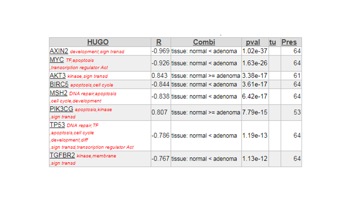
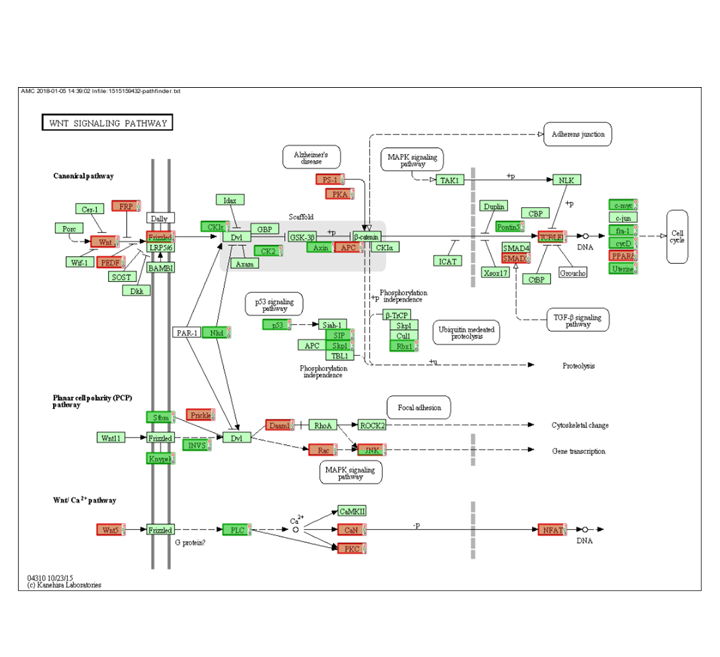
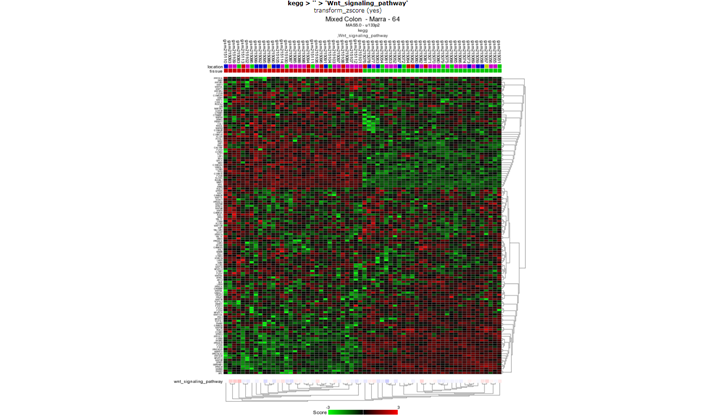

Finding and analyzing differential expressed genes using two Colon datasets
=================================

*Finding and analyzing differential expressed genes using two Colon datasets*

The purpose of this practical session is to get a grip on microarray data analysis.
We will try to answer some questions using two colorectal cancer datasets by applying
the web based analysis platform R2 (http://r2.amc.nl ir http://r2platform.com) which has been developed within
the Department of Oncogenomics at the Academic Medical Center (AMC) in Amsterdam,
the Netherlands. The principles and features you will encounter during this workshop
are well established in the community that analyze and visualize microarray data.
An online step by step tutorial book is available in the help section of R2.
We will often refer to these tutorials.

This resource is located online at http://r2-training-courses.readthedocs.io

Introduction
------------

**First Part: Colon versus Normal tissue**

In the first part we start by analyzing a dataset that has been used to identify the differences between normal tissue and colon adenomas. This dataset can be found in R2 as "Mixed Colon - Marra - 64 - MAS5.0 - u133p2".
For more information on the background of this dataset click on the infobox icon ‘i’ next to the current selected dataset.
The name of a dataset is composed of a number of elements, separated with a ‘-’. The Marra set consists of 64 samples and is of a mixed type (32 normal and 32 adenomas).
The normalization was performed according to the MAS5.0 algorithm and we are dealing with an Affymetrix U133 plus 2.0 microarray consisting of ~54,000 so called probe-sets (reporters).

We will use R2 to generate a list of genes which are differentially expressed between the Normal subgroup and Adenoma subgroup in the Marra dataset. Chapter 6 of the R2 tutorial book (“Differential expression of Genes ..”) describes how you can use the “Find differential expression between groups” module in more detail. 
Multiple testing corrections adjust p-values derived from multiple statistical tests to correct for false positives. In microarray data analysis, false positives are genes that are found to be statistically different between conditions, but are not in reality. (For more on multiple testing correction: see chapter 6 step 7 in the tutorial book)

Select the **Mixed Colon - Marra - 64 - MAS5.0 - u133p2** or click the button 

<form name="Mara 64 set " action="https://hgserver1.amc.nl/cgi-bin/r2/main.cgi" enctype="multipart/form-data" target="R2" method="post">
  <input type="hidden" name="table" value="ps_avgpres_coloncombi64_u133p2">
  <button type="submit" >Go to Mixed Colon Marra</button>
</form>  

In the Main menu, 3 ‘Select type of analysis’ select the “Find differential expression between groups” module. And click next or click the button 

<form name='Find Diff' action="https://hgserver1.amc.nl/cgi-bin/r2/main.cgi" enctype="multipart/form-data" method='POST' target='FindDiff'>
<input type='hidden' name='option' value='findgene1'>
<input type='hidden' name='table' value='ps_avgpres_coloncombi64_u133p2'>
<button type="submit" >Go to Find differential </button>
</form>

In the next panel you have to select a so called ‘track’.
Tracks contain the annotation parameters of series of arrays of tumors or experiments. Choose the ‘tissue’ track, this contains assignment of each sample to the tumor or normal tissue group. Several other selection criteria can be adapted. Most settings are suited for regular analyses

**Question 1a:**

You can also choose between several multiple testing correction methods. Which one is the most stringent?
*Answer: At the end of this training course*

Before we start the calculations, make sure you selected ‘log2’ as transformation and use p<0.01 as a p-value cutoff. Then click ‘next’, and leave the group selection as is, click next to start the analysis.

**Question 1b:**

R2 has generated a large list of genes which are differentially expressed between the selected subgroups. Can you say something about the distribution between up- or down-regulated genes? Are the groups equal in size?.
*Answer: At the end of this training course*

**Question 1c:**

Next to many publicly available datasets, R2 is also hosting a lot of curated lists of genes which we call **gene categories** (gene sets). These gene categories can be used to restrict an analysis as well. We can adapt our current search by scrolling down to the end of our gene list. In the ‘Adjustable Settings’ Panel in the Gene Filters box you can now use a Gene Category to filter your list. Re-generate a list that is specifically associated with (colorectal) cancer (hint: look in the gene category or KEGG pathway list to identify an interesting gene set).
*Answer: At the end of this training course*

**Question 2a:**

The most significant gene in the list is the AXIN2 gene. Click on this entry from your result set to open the Gene View. The graph shows a neat separation in groups. Scroll down to investigate the probesets that were used. AXIN2 is represented by no fewer than four reporters (probe sets) on the Affymetrix U133 Plus 2.0 chip. 

Examine the expression signals of the 4 probe sets, what do you notice
*Answer: At the end of this training course*

**Question 2b:**

Can you think of an explanation for this observation? (Tip: Use the R2 genome browser by clicking the 'R2 Tview'link in the probeset verification table.

**Question 2c:**

Do you think it is wise to represent AXIN2 by the average of the four probe sets. Why / why not? (Tip: Use the R2 genome browser by clicking the 'R2 Tview'link in the probeset verification table. 

**Question 3a: Pathway heatmap**

The WNT pathway is an important signal transduction cascade in the development of colon cancer.
Generate a list of genes which are differentially expressed comparing normal and adenoma within the WNT pathway KEGG, use the False Discovery Rate for multiple testing correction, log 2 values and P <0.01. You can use the KEGG Pathway from the Gene Categories selection menu.

**Question 3b:**

Generate a heatmap (Menu to the right) from the differentially expressed genes and take a look at the resulting image. Are all tumors neatly separated from the normal samples? Is this a special finding?

**Question 4a: Pathway Analysis**

Often, you do not immediately have an idea which pathways you could look for in your comparisons between groups (normal versus adenoma in our case). A module within R2 providing you with some suggestions is the so called KEGG Pathway Finder by Groups. It assesses whether the number of genes that show significant differential expression between normal and adenoma is significantly higher than you would expect compared to all genes that are mentioned in KEGG. 

Perform a KEGG pathway analysis from the ‘main’ page. Make sure that under Representation: all is selected (both under and overrepresentation) Are there KEGG pathways overrepresented in the differentially expressed genes between adenoma and normal tissue?

If this is true which pathway (Set the p-value 0.01 for the analysis and select striking pathways).

**Question 4b**

In the current pathway analysis, the WNT pathway is not very pronounced. Click on the WNT pathway AMCmap (the blue A link) of the pathway in detail. 
It appears that there are not many changes found? Can you explain the results of the analysis?

**Question 5a Pathway heatmap specified**

The previous task has shown that a number of WNT pathway genes were represented in the result list. We can also view all genes in the pathway via a heatmap. You can do this using the "View a geneset (Heatmap)" option from the main menu. 

Take a look at the WNT pathway with 3: "View GeneSet (Heatmap)". You can find the WNT path way in in the KEGG>all section. Are all tumors neatly separated from the normals? Is this special? Why / why not? 

Answers
--------

Question 1a:

*With high throughput experiments like micro-arrays it is important to correct for the random effects that good be falsely significant.  Therefore it is common practice to correct for those effects. The Bonferroni Method is the most stringed method R2 is offering. . A more detailed explanation you can find in the chapter of the the R2 tutorial. You can find the R2 tutorial in the left menu of R2 on the main screen.*

Question 1b:
*A small table below the grey buttons on the right provides the separate numbers of the up and down regulated genes. ~80000 genes in total. ~4000 genes are higher in adenomas of expressive and 3903 lower than in normal tissue.*

Question 1c:

*Also using Oncogenesis Category or KEGG colorectal cancer , AXIN2 is number one. Table below is the toplist of the analysis in 1b*

	
[**Finding differential expression progression.**](_static/images/practical_geneexpression_list.png)

Question 2a:

*In the perfect world each probeset should provide a more or less equal absolute value which is not the case.  The 222696_at signal is much higher compared to the other N-MYC probeset.*

	
[**Finding differential expression :probeset table **](_static/images/practical_geneexpression_probesettable.png)

Question 2b:

[**Finding differential expression: probeset verification **](_static/images/practical_geneexpression_probesetverification.png)

Question 2c:

*Due to the large difference in the signals wit will not be smart in this case to take the average. The successors of this platform are designed differently as well as the isolation methods. For the newer platforms there is no degradation and the probesets designed for the same gene give more or less the same signal.*

Question 3a:

64 genes
tissue: normal < adenoma 31
tissue: normal >= adenoma 33 

Question 3b:

*Neatly separated, but not very special. Only the genes that make a difference between the two groups viewed here. The Heatmap is based on a pre-selection which is already found*

[**Finding differential expression: heatmap **](_static/practical_geneexpression_heatmap1.png )

Question 4a:

*DNA replication and RNA transport are in the top off the list* 

Question 4b:

[**Finding differential expression: Pathway **](_static/practical_geneexpression_pathway.png )

Question 5a:

*Samples are well separated. This is special, we have all the genes in the wnt pathway used without preselection.*

[**Finding differential expression: heatmap **](_static/practical_geneexpression_heatmap2.png)

Question 5b:

This time not only the genes are used that make a difference in the group shown.  The clustering in task3b was based on differentially expressed genes already found so it’s not surprising you find a heatmap with nice clusters.
